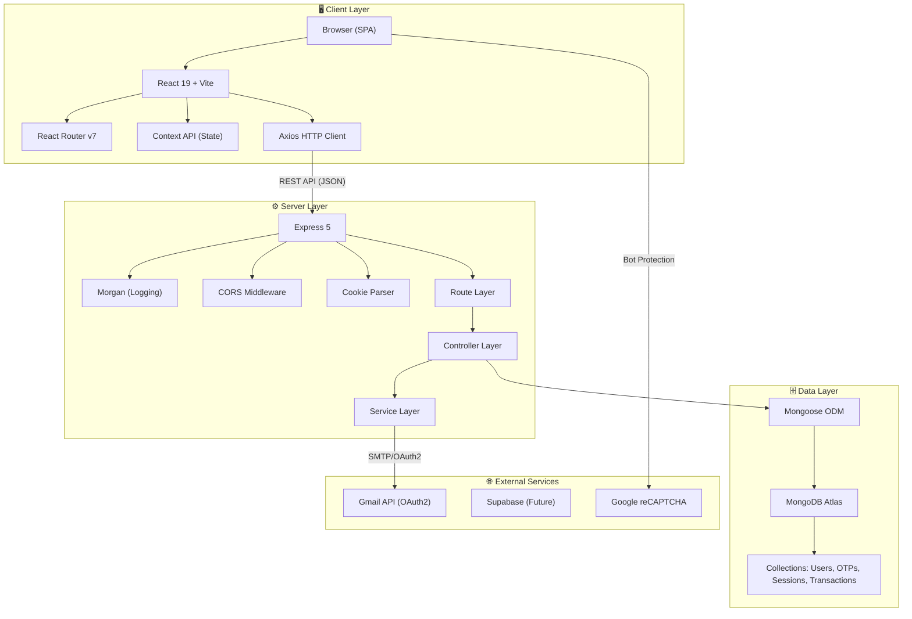
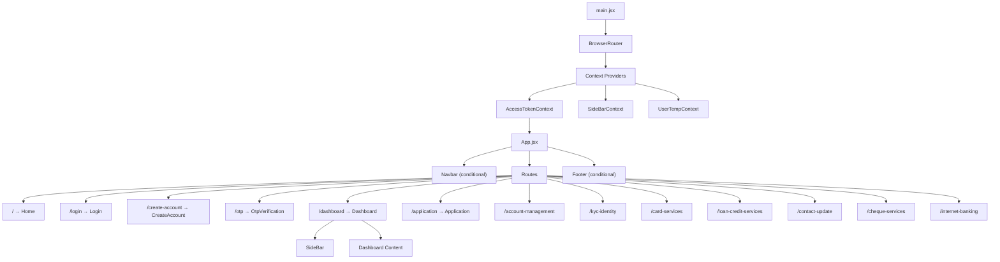
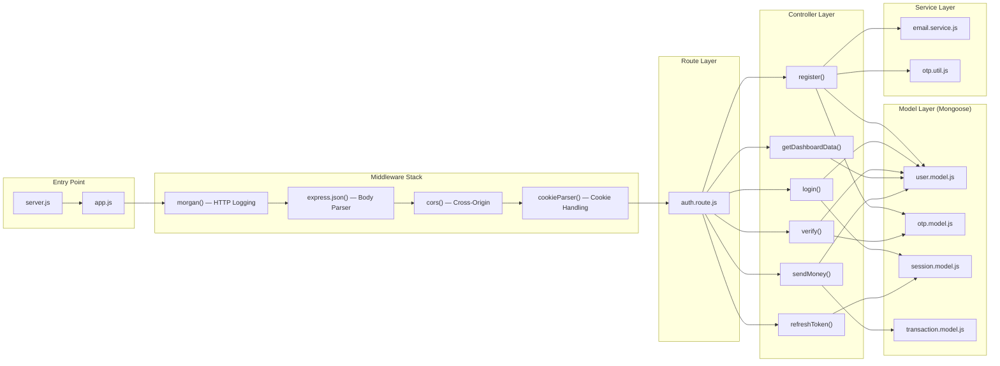
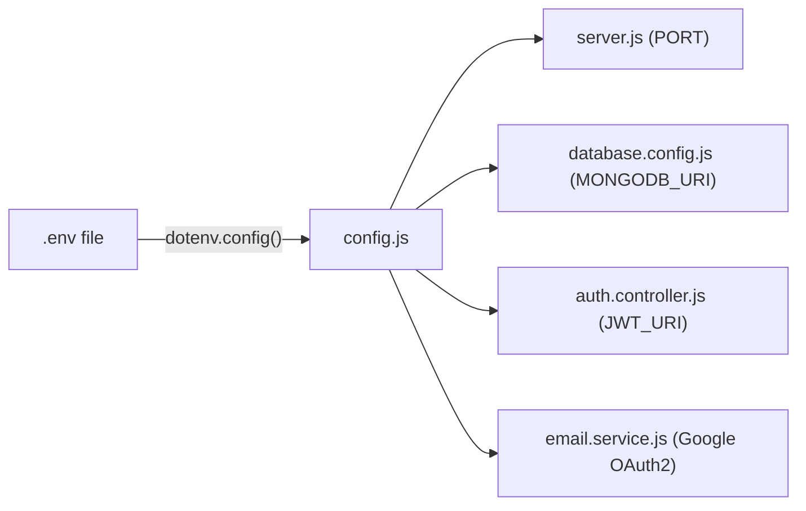
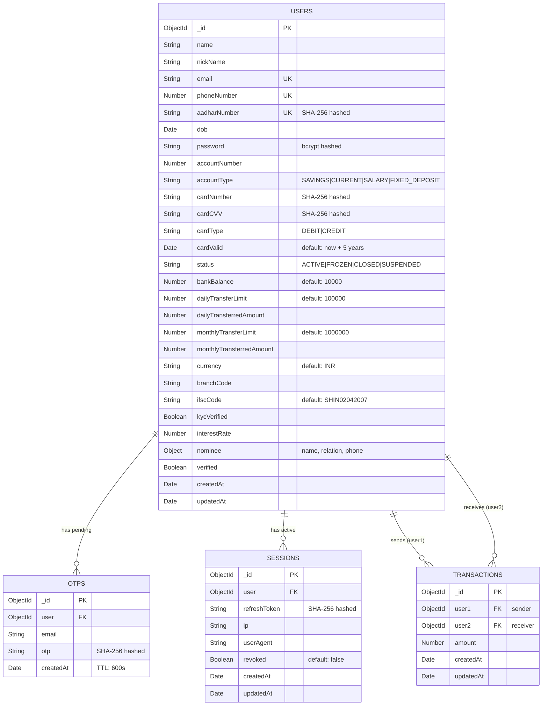
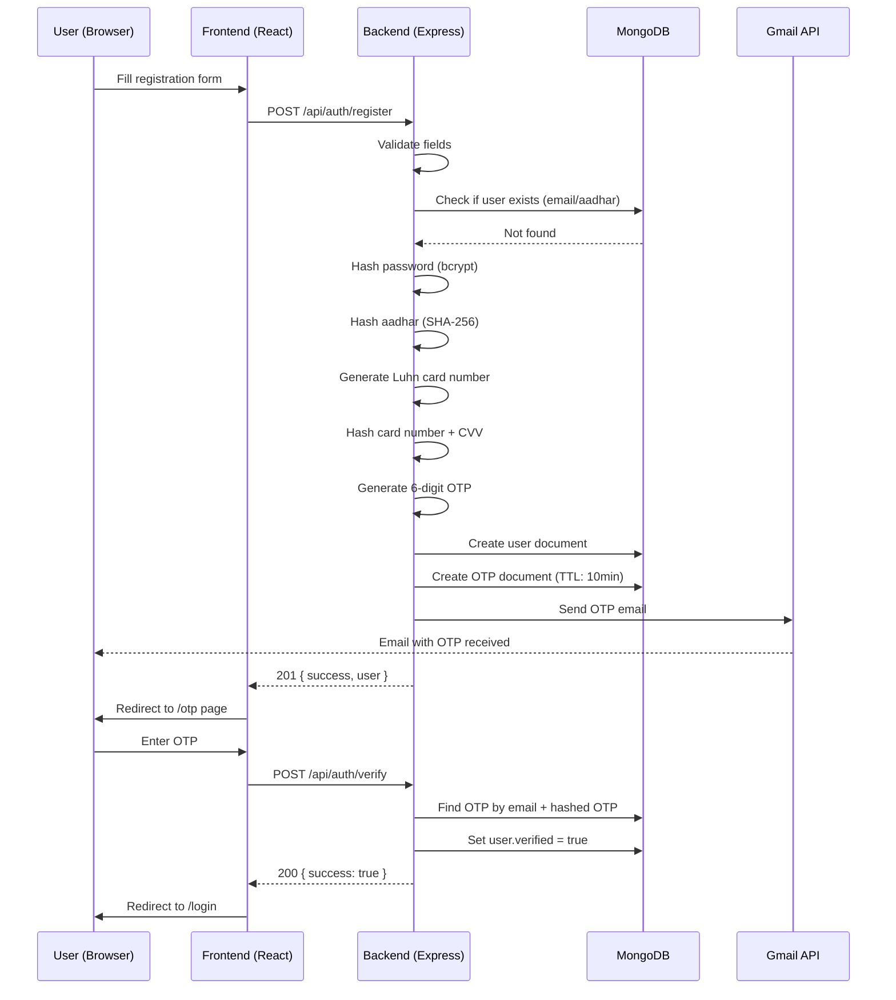
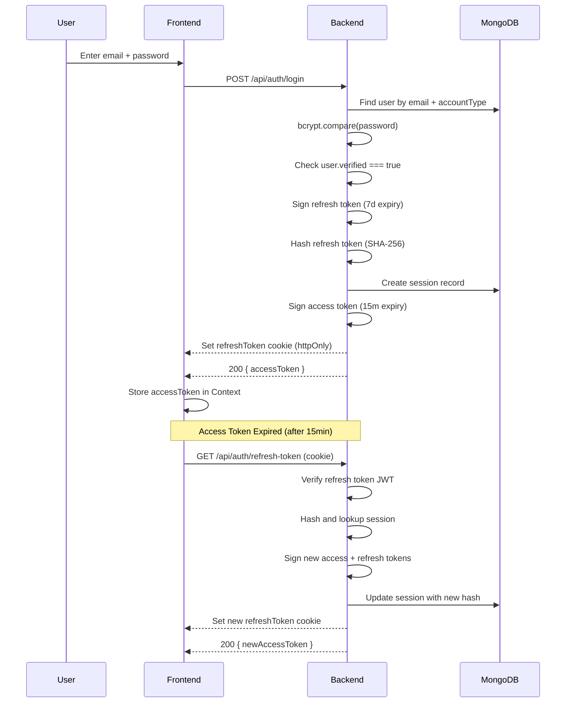
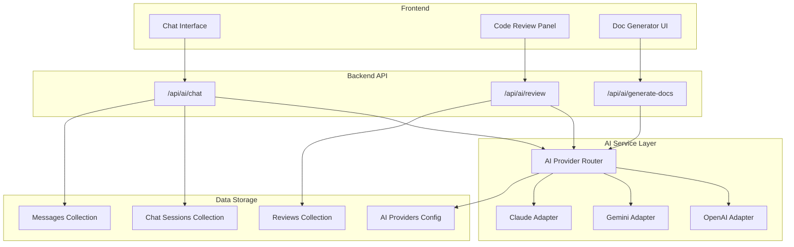
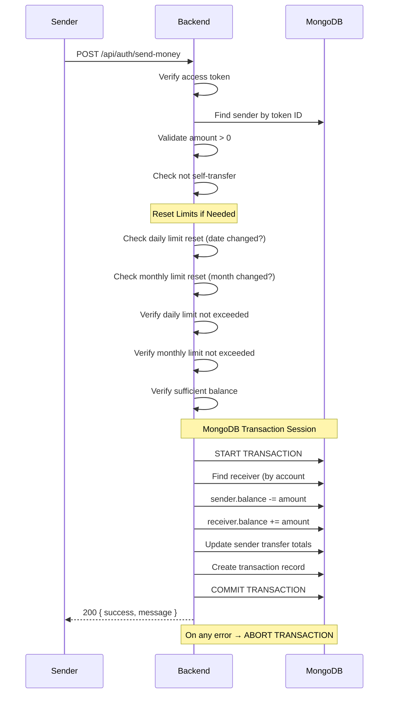

# 🏗 Shinrai Bank — Architecture Documentation

## Table of Contents

- [System Overview](#system-overview)
- [Frontend Architecture](#frontend-architecture)
- [Backend Architecture](#backend-architecture)
- [Database Design](#database-design)
- [Authentication & Security Flow](#authentication--security-flow)
- [AI Integration Flow](#ai-integration-flow)
- [Key User Journeys](#key-user-journeys)

---

## System Overview

Shinrai Bank follows a **client-server architecture** with a clear separation between the presentation layer (React SPA) and the business logic layer (Express REST API), connected via HTTP/JSON.

### High-Level System Diagram



### Technology Decisions

| Decision | Choice | Rationale |
|---|---|---|
| Frontend Framework | React 19 | Latest stable with concurrent features |
| Build Tool | Vite 8 | Fast HMR, native ESM support |
| CSS Framework | Tailwind CSS 3 | Utility-first, shadcn/ui compatibility |
| Component Library | shadcn/ui | Customizable, accessible, React-native |
| Backend Framework | Express 5 | Mature, async route handler support |
| Database | MongoDB Atlas | Flexible schema for banking, cloud-hosted |
| ODM | Mongoose 9 | Schema validation, middleware, population |
| Auth | JWT (access + refresh) | Stateless auth with session tracking |
| Email | Nodemailer + Gmail OAuth2 | Free, reliable for transactional emails |

---

## Frontend Architecture

### Component Hierarchy



### State Management Strategy

The application uses React's **Context API** for global state — no external state management library.

| Context | Location | Purpose | Consumed By |
|---|---|---|---|
| `AccessTokenContext` | `contexts/AccessTokenContext.jsx` | Stores JWT access token; auto-refreshes on mount | Dashboard, API calls |
| `SideBarContext` | `contexts/SideBarContext.jsx` | Tracks current sidebar selection based on URL path | Sidebar, App |
| `UserTempContext` | `contexts/UserTempContext.jsx` | Holds temporary user data during registration flow | CreateAccount → OTP |

### Routing Architecture

```
/ ─────────────────── Home (public, with Navbar + Footer)
/login ────────────── Login (standalone, no Navbar/Footer)
/create-account ───── CreateAccount (standalone)
/otp ──────────────── OtpVerification (standalone)
/dashboard ────────── Dashboard (with Navbar + Footer + Sidebar)
/application ──────── Application (with Navbar + Footer)
/account-management ─ AccountManagement (with Navbar + Footer)
/kyc-identity ─────── KYC (with Navbar + Footer)
/card-services ────── CardServices (with Navbar + Footer)
/loan-credit-services LoanServices (with Navbar + Footer)
/contact-update ───── ContactServices (with Navbar + Footer)
/cheque-services ──── ChequeServices (with Navbar + Footer)
/internet-banking ─── InternetBanking (with Navbar + Footer)
```

**Layout Rules:**
- Routes `/create-account`, `/login`, and `/otp` hide the Navbar and Footer
- All other routes display the full layout with Navbar + Footer
- Dashboard includes an additional Sidebar component

### Services Layer

| File | Functions | Description |
|---|---|---|
| `services/api.js` | `registerUser()`, `verifyUser()`, `loginUser()`, `getDashboardData()` | Axios-based API client wrapping all backend calls |
| `services/supabaseClient.js` | `supabase` client instance | Supabase integration (future use — file upload, realtime) |

### Styling Architecture

```
Tailwind CSS 3 (utility classes)
    └── shadcn/ui (component primitives via class-variance-authority)
        └── tw-animate-css (animation utilities)
            └── Motion (Framer Motion for complex animations)
```

- **Base styles** in `index.css` (CSS custom properties for shadcn/ui theming)
- **Component styles** in `App.css` (minimal, mostly utility-based)
- **Tailwind config** extends default theme with custom fonts (Inter variable)
- **Class merging** via `clsx` + `tailwind-merge` (in `lib/utils.js`)

---

## Backend Architecture

### Layer Architecture



### Request Pipeline

```
HTTP Request
  │
  ├── morgan()          →  Log request method, URL, status, timing
  ├── express.json()    →  Parse JSON body into req.body
  ├── cors()            →  Validate origin (http://localhost:5173)
  ├── cookieParser()    →  Parse cookies into req.cookies
  │
  ├── Router Matching   →  /api/auth/* → authRouter
  │
  ├── Controller        →  Business logic execution
  │   ├── Input validation (manual checks)
  │   ├── Database operations (Mongoose)
  │   ├── External service calls (Email)
  │   └── JWT operations (sign/verify)
  │
  └── Response          →  JSON { success, message, data? }
```

### Configuration Management



All environment variables are loaded once via `dotenv` and exported as a frozen config object.

---

## Database Design

### Collections Overview



### Design Decisions

| Decision | Rationale |
|---|---|
| SHA-256 for card/Aadhar numbers | One-way hashing — these are identifiers, not secrets to decrypt |
| bcrypt for passwords | Industry standard, salt + work factor prevent rainbow tables |
| TTL index on OTPs (600s) | MongoDB auto-deletes expired OTPs, no cleanup cron needed |
| Session tracking with IP/UA | Enables suspicious login detection and session management |
| Atomic transactions for transfers | MongoDB sessions ensure consistency — both accounts update or neither |
| Phone number as account number | Simplified account lookup (used as both phone and account ID) |

> For the complete database design including proposed new collections, see [DATABASE_DESIGN.md](./DATABASE_DESIGN.md).

---

## Authentication & Security Flow

### Registration Flow



### Login & Token Lifecycle



### Token Architecture

```
┌─────────────────────────────────────────┐
│              Access Token               │
│  • Stored in: React Context (memory)    │
│  • Lifetime: 15 minutes                 │
│  • Payload: { id: user._id }            │
│  • Sent via: Authorization header       │
│  • Purpose: API request authentication  │
└─────────────────────────────────────────┘

┌─────────────────────────────────────────┐
│             Refresh Token               │
│  • Stored in: HTTP-only cookie          │
│  • Lifetime: 7 days                     │
│  • Payload: { id: user._id }            │
│  • Sent via: Cookie (automatic)         │
│  • DB record: SHA-256 hash in Sessions  │
│  • Purpose: Rotate access tokens        │
│  • Rotation: New refresh token per use  │
└─────────────────────────────────────────┘
```

---

## AI Integration Flow

> **Note:** AI integration is a planned future feature. The architecture below shows the proposed design for integrating AI-powered code review, documentation generation, and chat capabilities.

### Proposed Architecture



### Provider Abstraction

The AI layer uses a **strategy pattern** to abstract provider-specific implementations:

```javascript
// Planned interface
class AIProvider {
    async chat(messages, options) { }
    async reviewCode(code, language) { }
    async generateDocs(code, type) { }
}
```

Each provider (OpenAI, Gemini, Claude) implements this interface, allowing runtime switching based on the `AIProviders` configuration collection.

---

## Key User Journeys

### Money Transfer Flow



---

## Deployment Considerations

### Current Setup (Development)
- Frontend: Vite dev server on `localhost:5173`
- Backend: Nodemon on `localhost:3000`
- Database: MongoDB Atlas (cloud)
- Email: Gmail OAuth2

### Production Recommendations

| Concern | Recommendation |
|---|---|
| Frontend Hosting | Vercel, Netlify, or CDN-backed static hosting |
| Backend Hosting | Railway, Render, AWS EC2, or Heroku |
| Database | MongoDB Atlas (M10+ for production) |
| Environment Variables | Platform-native secrets management |
| HTTPS | Mandatory — enforce via reverse proxy (nginx) |
| Rate Limiting | Add `express-rate-limit` middleware |
| Logging | Structured logging with Winston or Pino |
| Monitoring | PM2 process manager with health checks |
| CI/CD | GitHub Actions for automated testing and deployment |
