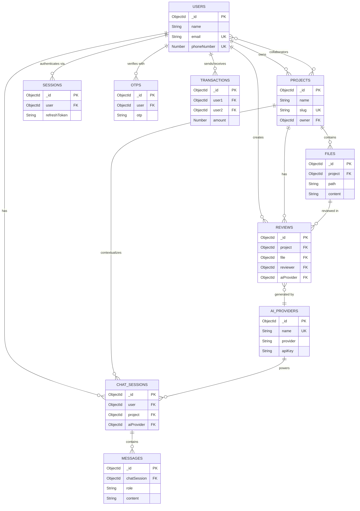

# 🗃 Shinrai Bank — Database Design Document

## Table of Contents

- [Overview](#overview)
- [Existing Collections](#existing-collections-banking)
- [Proposed New Collections](#proposed-new-collections-code-review--ai-platform)
- [Schema Definitions](#schema-definitions)
- [Indexes](#indexes)
- [Relationships Diagram](#relationships-diagram)

---

## Overview

The Shinrai Bank database uses **MongoDB Atlas** with **Mongoose 9** as the ODM. The design is split into two domains:

1. **Banking Domain** (existing) — User accounts, authentication, and financial transactions
2. **Code Review & AI Platform Domain** (proposed) — Projects, file management, code reviews, AI chat, and provider configuration

All collections use:
- `timestamps: true` for automatic `createdAt`/`updatedAt` fields
- Soft-delete where applicable (`isDeleted` flag)
- Indexed fields for query performance

---

## Existing Collections (Banking)

### Users

Stores all bank account holder information, card details, and financial limits.

| Field | Type | Required | Unique | Default | Description |
|---|---|---|---|---|---|
| `_id` | ObjectId | auto | ✅ | — | Primary key |
| `name` | String | ✅ | — | — | Full name |
| `nickName` | String | — | — | — | Display name |
| `email` | String | ✅ | ✅ | — | Email address |
| `phoneNumber` | Number | ✅ | ✅ | — | Phone number |
| `aadharNumber` | String | ✅ | ✅ | — | SHA-256 hashed Aadhar |
| `password` | String | ✅ | — | — | bcrypt hashed password |
| `dob` | Date | ✅ | — | — | Date of birth |
| `address` | String | — | — | — | Postal address |
| `accountNumber` | Number | — | — | — | Account number (= phone) |
| `accountType` | Enum | — | — | `SAVINGS` | `SAVINGS\|CURRENT\|SALARY\|FIXED_DEPOSIT` |
| `cardNumber` | String | — | — | — | SHA-256 hashed card number |
| `cardCVV` | String | — | — | — | SHA-256 hashed CVV |
| `cardType` | Enum | — | — | `DEBIT` | `DEBIT\|CREDIT` |
| `cardValid` | Date | — | — | now + 5 years | Card expiry date |
| `status` | Enum | — | — | `ACTIVE` | `ACTIVE\|FROZEN\|CLOSED\|SUSPENDED` |
| `bankBalance` | Number | — | — | `10000` | Current balance (INR) |
| `dailyTransferLimit` | Number | — | — | `100000` | Daily transfer cap |
| `dailyTransferredAmount` | Number | — | — | `0` | Amount transferred today |
| `monthlyTransferLimit` | Number | — | — | `1000000` | Monthly transfer cap |
| `monthlyTransferredAmount` | Number | — | — | `0` | Amount transferred this month |
| `lastDailyReset` | Date | — | — | now | Last daily limit reset |
| `lastMonthlyReset` | Date | — | — | now | Last monthly limit reset |
| `currency` | String | — | — | `INR` | Account currency |
| `branchCode` | String | — | — | `Shinrai Branch of India` | Branch identifier |
| `ifscCode` | String | — | — | `SHIN02042007` | IFSC code |
| `kycVerified` | Boolean | — | — | `false` | KYC completion status |
| `interestRate` | Number | — | — | `0` | Annual interest rate |
| `nominee` | Object | — | — | — | `{ name, relation, phone }` |
| `verified` | Boolean | — | — | `false` | Email verified |
| `createdAt` | Date | auto | — | — | Account creation time |
| `updatedAt` | Date | auto | — | — | Last update time |

### OTPs

Stores one-time passwords for email verification. Auto-deleted after 10 minutes via TTL index.

| Field | Type | Required | Default | Description |
|---|---|---|---|---|
| `_id` | ObjectId | auto | — | Primary key |
| `user` | ObjectId | ✅ | — | Reference to Users |
| `email` | String | ✅ | — | Email this OTP was sent to |
| `otp` | String | ✅ | — | SHA-256 hashed OTP |
| `createdAt` | Date | — | `Date.now` | TTL index: expires after 600s |

### Sessions

Tracks active JWT refresh token sessions for each user.

| Field | Type | Required | Default | Description |
|---|---|---|---|---|
| `_id` | ObjectId | auto | — | Primary key |
| `user` | ObjectId | ✅ | — | Reference to Users |
| `refreshToken` | String | ✅ | — | SHA-256 hashed refresh token |
| `ip` | String | ✅ | — | Client IP address |
| `userAgent` | String | ✅ | — | Browser user-agent string |
| `revoked` | Boolean | — | `false` | Whether session was revoked |
| `createdAt` | Date | auto | — | Session start time |
| `updatedAt` | Date | auto | — | Last refresh time |

### Transactions

Records all money transfers between users.

| Field | Type | Required | Description |
|---|---|---|---|
| `_id` | ObjectId | auto | Primary key |
| `user1` | ObjectId | ✅ | Sender (ref: Users) |
| `user2` | ObjectId | ✅ | Receiver (ref: Users) |
| `amount` | Number | ✅ | Transfer amount |
| `createdAt` | Date | auto | Transaction time |
| `updatedAt` | Date | auto | — |

---

## Proposed New Collections (Code Review & AI Platform)

These collections extend the platform to support project management, code review, and AI-assisted features.

### Projects

Represents a codebase or repository being managed/reviewed.

| Field | Type | Required | Unique | Default | Description |
|---|---|---|---|---|---|
| `_id` | ObjectId | auto | ✅ | — | Primary key |
| `name` | String | ✅ | — | — | Project display name |
| `slug` | String | ✅ | ✅ | — | URL-safe identifier |
| `description` | String | — | — | `""` | Project description |
| `owner` | ObjectId | ✅ | — | — | Reference to Users (creator) |
| `collaborators` | [ObjectId] | — | — | `[]` | Users with access |
| `repositoryUrl` | String | — | — | — | Git repository URL |
| `defaultBranch` | String | — | — | `"main"` | Default branch name |
| `language` | String | — | — | — | Primary programming language |
| `framework` | String | — | — | — | Primary framework |
| `status` | Enum | — | — | `ACTIVE` | `ACTIVE\|ARCHIVED\|DELETED` |
| `settings` | Object | — | — | `{}` | Project-specific configuration |
| `lastActivityAt` | Date | — | — | `Date.now` | Last action timestamp |
| `isDeleted` | Boolean | — | — | `false` | Soft delete flag |
| `createdAt` | Date | auto | — | — | — |
| `updatedAt` | Date | auto | — | — | — |

### Files

Represents individual files within a project, with version tracking.

| Field | Type | Required | Default | Description |
|---|---|---|---|---|
| `_id` | ObjectId | auto | — | Primary key |
| `project` | ObjectId | ✅ | — | Reference to Projects |
| `path` | String | ✅ | — | Full file path (e.g., `src/app.js`) |
| `filename` | String | ✅ | — | File name only (e.g., `app.js`) |
| `extension` | String | — | — | File extension (e.g., `.js`) |
| `language` | String | — | — | Detected language |
| `content` | String | — | `""` | Current file content |
| `previousContent` | String | — | `""` | Content before last change (for diff) |
| `sizeBytes` | Number | — | `0` | File size in bytes |
| `lineCount` | Number | — | `0` | Number of lines |
| `checksum` | String | — | — | SHA-256 hash of content |
| `lastModifiedBy` | ObjectId | — | — | Reference to Users |
| `version` | Number | — | `1` | Version counter |
| `status` | Enum | — | `ACTIVE` | `ACTIVE\|MODIFIED\|DELETED` |
| `metadata` | Object | — | `{}` | Custom metadata |
| `isDeleted` | Boolean | — | `false` | Soft delete flag |
| `createdAt` | Date | auto | — | — |
| `updatedAt` | Date | auto | — | — |

### Reviews

Stores code review sessions — both manual and AI-generated.

| Field | Type | Required | Default | Description |
|---|---|---|---|---|
| `_id` | ObjectId | auto | — | Primary key |
| `project` | ObjectId | ✅ | — | Reference to Projects |
| `file` | ObjectId | — | — | Reference to Files (if single-file review) |
| `reviewer` | ObjectId | ✅ | — | Reference to Users (who initiated) |
| `aiProvider` | ObjectId | — | — | Reference to AIProviders (if AI-assisted) |
| `title` | String | ✅ | — | Review title/summary |
| `description` | String | — | `""` | Review context/notes |
| `type` | Enum | — | `MANUAL` | `MANUAL\|AI_GENERATED\|HYBRID` |
| `category` | Enum | — | `GENERAL` | `GENERAL\|SECURITY\|PERFORMANCE\|STYLE\|BUG\|REFACTOR` |
| `status` | Enum | — | `PENDING` | `PENDING\|IN_PROGRESS\|COMPLETED\|DISMISSED` |
| `severity` | Enum | — | `MEDIUM` | `CRITICAL\|HIGH\|MEDIUM\|LOW\|INFO` |
| `findings` | [Object] | — | `[]` | Array of `{ line, message, severity, suggestion }` |
| `diffSnapshot` | String | — | — | Unified diff at time of review |
| `originalContent` | String | — | — | File content before changes |
| `modifiedContent` | String | — | — | File content after changes |
| `score` | Number | — | — | Overall quality score (0-100) |
| `resolvedAt` | Date | — | — | When review was resolved |
| `metadata` | Object | — | `{}` | Provider-specific metadata |
| `isDeleted` | Boolean | — | `false` | Soft delete flag |
| `createdAt` | Date | auto | — | — |
| `updatedAt` | Date | auto | — | — |

### AI Providers

Configuration for AI service integrations. Supports multiple providers.

| Field | Type | Required | Unique | Default | Description |
|---|---|---|---|---|---|
| `_id` | ObjectId | auto | ✅ | — | Primary key |
| `name` | String | ✅ | ✅ | — | Provider name (e.g., "OpenAI") |
| `slug` | String | ✅ | ✅ | — | URL-safe identifier |
| `provider` | Enum | ✅ | — | — | `OPENAI\|GEMINI\|CLAUDE\|CUSTOM` |
| `apiKey` | String | ✅ | — | — | Encrypted API key |
| `baseUrl` | String | — | — | — | Custom API base URL (for self-hosted) |
| `models` | [Object] | — | `[]` | Available models: `[{ name, id, maxTokens, costPer1k }]` |
| `defaultModel` | String | — | — | — | Default model identifier |
| `rateLimits` | Object | — | `{}` | `{ requestsPerMinute, tokensPerMinute }` |
| `isActive` | Boolean | — | `true` | Whether provider is enabled |
| `capabilities` | [Enum] | — | `[]` | `CHAT\|CODE_REVIEW\|DOC_GENERATION\|TEST_GENERATION\|DIFF_ANALYSIS` |
| `configuration` | Object | — | `{}` | Provider-specific settings (temperature, etc.) |
| `usageStats` | Object | — | `{}` | `{ totalRequests, totalTokens, totalCost }` |
| `lastHealthCheck` | Date | — | — | Last connectivity check |
| `addedBy` | ObjectId | ✅ | — | Reference to Users (admin) |
| `createdAt` | Date | auto | — | — |
| `updatedAt` | Date | auto | — | — |

### Chat Sessions

Conversational AI sessions linked to a user and optionally to a project.

| Field | Type | Required | Default | Description |
|---|---|---|---|---|
| `_id` | ObjectId | auto | — | Primary key |
| `user` | ObjectId | ✅ | — | Reference to Users |
| `project` | ObjectId | — | — | Reference to Projects (optional context) |
| `aiProvider` | ObjectId | ✅ | — | Reference to AIProviders |
| `title` | String | — | `"New Chat"` | Chat session title |
| `model` | String | ✅ | — | AI model used (e.g., "gpt-4") |
| `systemPrompt` | String | — | — | System/context prompt |
| `context` | Object | — | `{}` | Additional context (file refs, review refs) |
| `status` | Enum | — | `ACTIVE` | `ACTIVE\|ARCHIVED\|DELETED` |
| `messageCount` | Number | — | `0` | Cached count of messages |
| `totalTokensUsed` | Number | — | `0` | Total tokens consumed |
| `estimatedCost` | Number | — | `0` | Estimated cost in USD |
| `lastMessageAt` | Date | — | — | Timestamp of last message |
| `isPinned` | Boolean | — | `false` | Whether session is pinned |
| `tags` | [String] | — | `[]` | User-defined tags |
| `isDeleted` | Boolean | — | `false` | Soft delete flag |
| `createdAt` | Date | auto | — | — |
| `updatedAt` | Date | auto | — | — |

### Messages

Individual messages within a chat session (user and AI responses).

| Field | Type | Required | Default | Description |
|---|---|---|---|---|
| `_id` | ObjectId | auto | — | Primary key |
| `chatSession` | ObjectId | ✅ | — | Reference to ChatSessions |
| `role` | Enum | ✅ | — | `USER\|ASSISTANT\|SYSTEM` |
| `content` | String | ✅ | — | Message text content |
| `contentType` | Enum | — | `TEXT` | `TEXT\|CODE\|MARKDOWN\|DIFF\|ERROR` |
| `codeBlocks` | [Object] | — | `[]` | `[{ language, code, filename }]` |
| `attachments` | [Object] | — | `[]` | `[{ fileId, filename, snippet }]` |
| `tokenCount` | Number | — | `0` | Tokens used for this message |
| `model` | String | — | — | Model that generated the response |
| `latencyMs` | Number | — | — | Response time in milliseconds |
| `feedback` | Object | — | — | `{ rating: 1-5, comment }` |
| `parentMessageId` | ObjectId | — | — | For threaded replies |
| `isEdited` | Boolean | — | `false` | Whether content was edited |
| `editedAt` | Date | — | — | Last edit timestamp |
| `metadata` | Object | — | `{}` | Provider-specific response metadata |
| `isDeleted` | Boolean | — | `false` | Soft delete flag |
| `createdAt` | Date | auto | — | — |
| `updatedAt` | Date | auto | — | — |

---

## Indexes

### Existing Collections

```javascript
// Users — automatically indexed by unique fields
{ email: 1 }           // unique
{ phoneNumber: 1 }     // unique
{ aadharNumber: 1 }    // unique

// OTPs — TTL index for auto-expiry
{ createdAt: 1, expireAfterSeconds: 600 }
{ email: 1, otp: 1 }  // compound for lookup

// Sessions
{ refreshToken: 1 }    // fast lookup during refresh
{ user: 1, revoked: 1 } // find active sessions per user

// Transactions
{ user1: 1, createdAt: -1 } // sender history
{ user2: 1, createdAt: -1 } // receiver history
```

### New Collections

```javascript
// Projects
{ owner: 1 }
{ slug: 1 }            // unique
{ collaborators: 1 }
{ status: 1, lastActivityAt: -1 }

// Files
{ project: 1, path: 1 } // unique compound
{ project: 1, language: 1 }
{ checksum: 1 }

// Reviews
{ project: 1, status: 1 }
{ reviewer: 1, createdAt: -1 }
{ file: 1, status: 1 }
{ severity: 1, status: 1 }

// AI Providers
{ slug: 1 }            // unique
{ provider: 1, isActive: 1 }

// Chat Sessions
{ user: 1, status: 1, lastMessageAt: -1 }
{ project: 1 }
{ user: 1, isPinned: 1 }

// Messages
{ chatSession: 1, createdAt: 1 }  // chronological within session
{ chatSession: 1, role: 1 }
```

---

## Relationships Diagram



---

## Schema Modification Justifications

The following modifications were made to the suggested table structure:

| Change | Justification |
|---|---|
| Added `slug` to Projects | URL-safe identifiers for routing and API paths |
| Added `collaborators` to Projects | Multi-user access control beyond just the owner |
| Added `previousContent` to Files | Enables diff comparison without version history table |
| Added `findings` array to Reviews | Structured storage for individual review comments per line |
| Added `capabilities` to AI Providers | Defines which features each provider supports |
| Added `codeBlocks` to Messages | First-class support for code snippets in chat |
| Added `estimatedCost` to Chat Sessions | Cost tracking per conversation |
| Added `contentType` to Messages | Distinguishes between text, code, diffs for rendering |
| Added `feedback` to Messages | User rating system for AI response quality |
| Added soft-delete (`isDeleted`) to new collections | Prevents accidental data loss, enables auditing |
